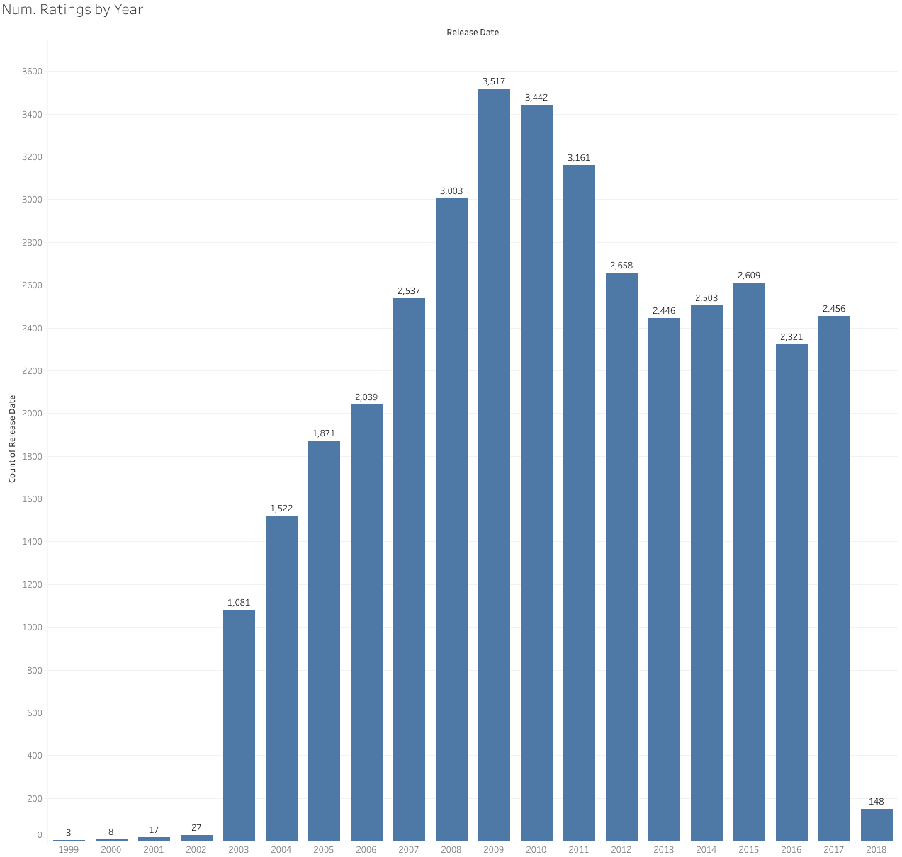
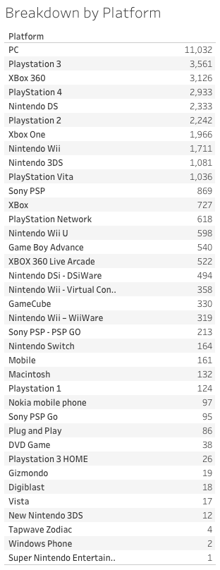
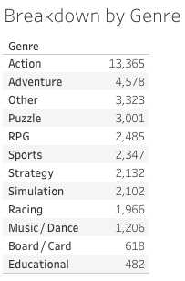
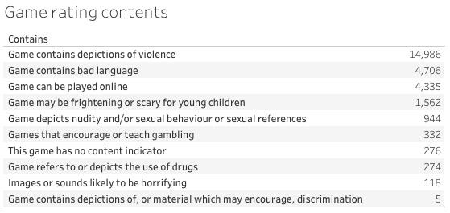
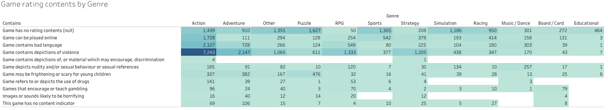

# PEGI Game Ratings Dataset (2018-02-04)

Dataset contains `28,757` rows of [PEGI](http://www.pegi.info/) game ratings from  from 1999 to February 04, 2018.

Data includes:
* Game title
* Age rating
* Release date
* Publisher name
* URL of the game publisher
* Game contents (violence/bad language etc.)
* Platform
* Genre

